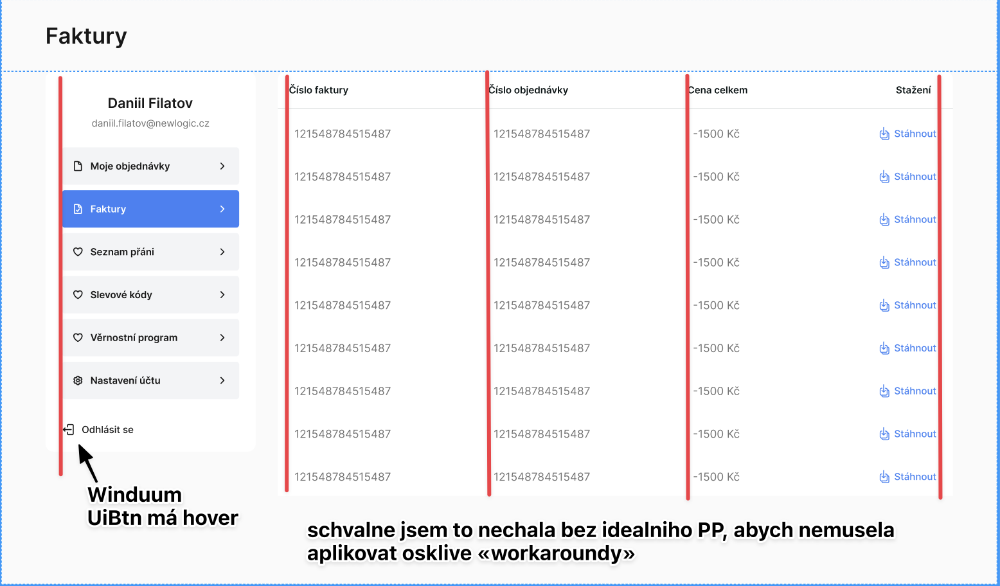

# Testovací úkol pro Newlogic

## Zadání:
- tři stránky
- náročnost max 2-3h
- povinně použít tailwindcss
- ui framework na tailwindcss dle libosti
- javascriptový framework dle libosti
- musí být plně responzivní
- pixel perfect přistup

## Tech Stack

... and 🔧 [Winduum](https://winduum.dev/)

## Pixel Perfect
### Moje objednavky

### Faktury

### Nastaveni uctu

#### 💬 Vysvetneli k PP

---
#### Created by Daria Liferova
📨 liferova.daria@gmail.com
 

